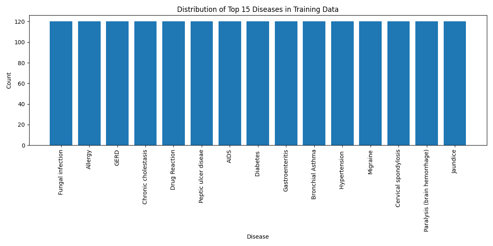
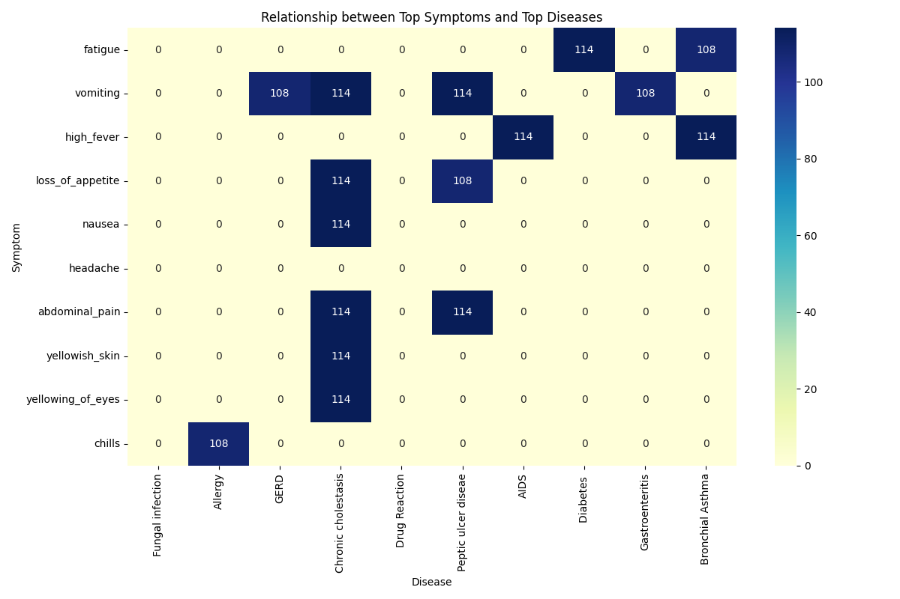
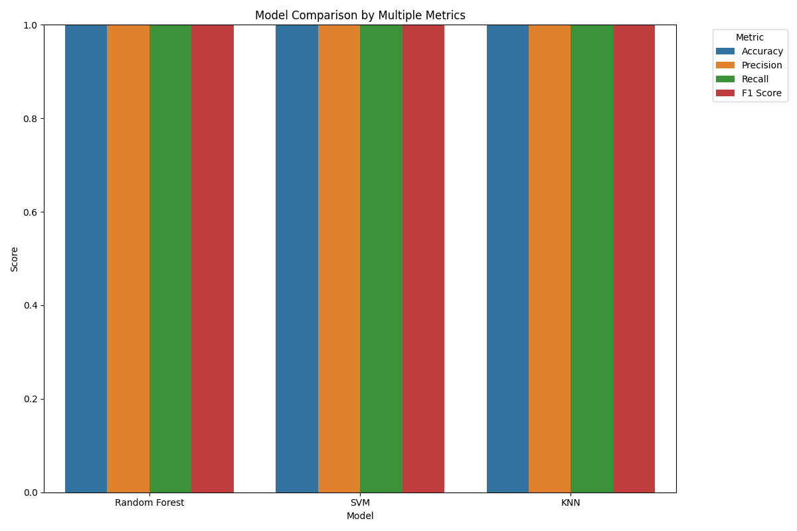
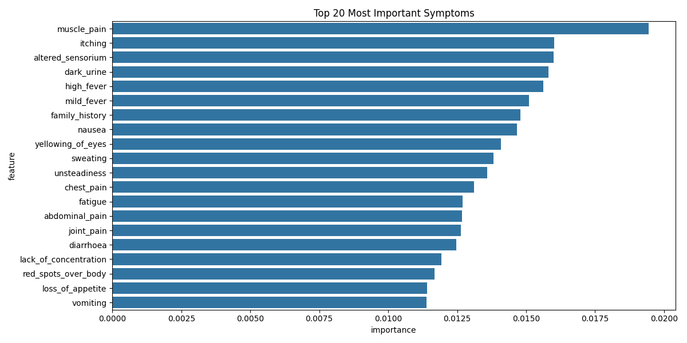
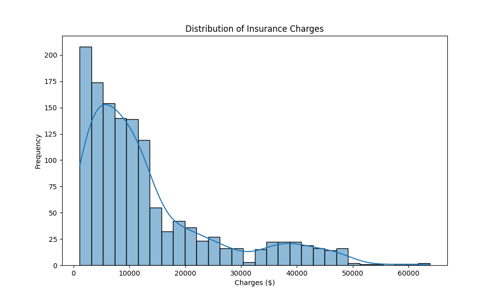
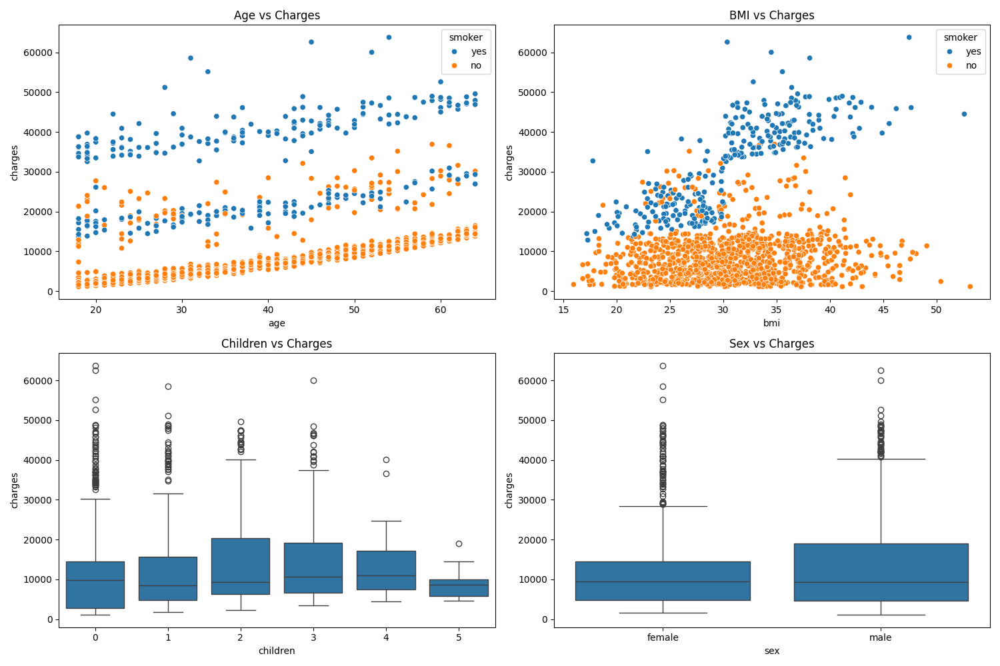
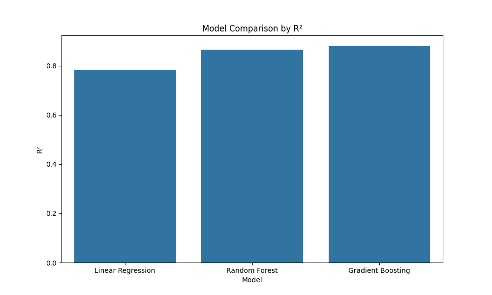
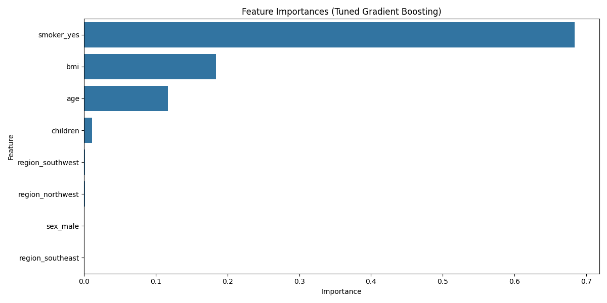

# Healthcare Machine Learning Project

This project implements machine learning techniques for healthcare applications, focusing on disease prediction from symptoms (classification) and medical insurance cost prediction (regression).

## Project Structure

- `11.py`: Classification implementation for disease prediction from symptoms (Task 1)
- `32.py`: Regression implementation for medical insurance cost prediction (Task 2)
- `report.md`: Comprehensive report of the analysis and findings
- `charts/`: Directory containing all visualizations
  - `task1/`: Charts for the classification task
  - `task2/`: Charts for the regression task

## Task 1: Classification (Disease Prediction)

The classification task uses a dataset of symptoms to predict diseases. The implementation includes:

- Data preprocessing and exploratory data analysis
- Feature engineering and selection
- Training and evaluation of multiple classification algorithms
- Model fine-tuning and performance comparison

### Key Visualizations

#### Disease Distribution

#### Symptom-Disease Relationship

#### Model Comparison

#### Feature Importance

## Task 2: Regression (Insurance Cost Prediction)

The regression task uses demographic and health information to predict medical insurance costs. The implementation includes:

- Data preprocessing and exploratory data analysis
- Feature engineering and transformation
- Training and evaluation of multiple regression algorithms
- Model fine-tuning and performance comparison

### Key Visualizations

#### Insurance Charges Distribution

#### Feature Relationships

#### Model Performance Comparison

#### Feature Importance

## Results Summary

### Classification Task
- Random Forest, SVM, and KNN all achieved excellent performance
- Random Forest was selected for fine-tuning
- The model achieved high accuracy on the test set
- Key symptoms were identified for disease prediction

### Regression Task
- Gradient Boosting performed best among the regression models
- After fine-tuning, the model achieved an R² of 0.882
- Smoking status was identified as the most important factor in determining insurance costs
- BMI and age were also significant predictors

## How to Run

1. Ensure you have Python 3.x installed with the required libraries (pandas, numpy, scikit-learn, matplotlib, seaborn)
2. Run the classification task: `python 11.py`
3. Run the regression task: `python 32.py`
4. View the report: `report.md`
