# Machine Learning in Healthcare: Classification and Regression Analysis

## Introduction

This report presents the analysis and results of two machine learning tasks applied to healthcare datasets: disease prediction from symptoms (classification) and medical insurance cost prediction (regression). The analysis demonstrates the application of various machine learning algorithms, their evaluation, and optimization. The implementation includes comprehensive data exploration, feature engineering, model training, evaluation, and fine-tuning to achieve optimal performance.

## Dataset Overview

### Dataset 1: Disease Prediction from Symptoms

This dataset contains binary symptom indicators (0 or 1) for various health conditions and a target variable 'prognosis' indicating the disease diagnosis. The dataset includes 132 symptom features and 41 unique disease categories. The data is split into training (4920 samples) and testing (41 samples) sets.

### Dataset 3: Medical Insurance Costs

This dataset contains information about 1338 insurance beneficiaries with features including age, sex, BMI, number of children, smoking status, region, and the target variable 'charges' representing medical insurance costs. The dataset has no missing values and includes both numerical and categorical features.

## Task 1: Classification (Disease Prediction)

### Data Preprocessing and EDA

The disease prediction dataset was analyzed for missing values (none found) and the distribution of diseases was examined. The dataset contains 132 symptom features (binary indicators) and 41 unique disease categories.

_Figure 1: Distribution of the top 15 diseases in the training dataset_

The most frequent symptoms were identified, providing insights into common health indicators across various diseases.

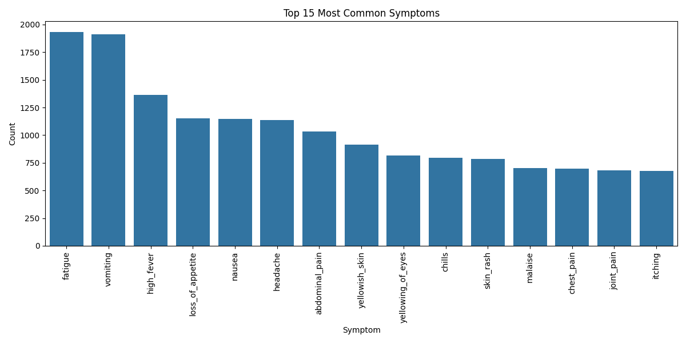
_Figure 2: Top 15 most common symptoms in the dataset_

Relationships between symptoms and diseases were visualized using heatmaps, revealing patterns of symptom co-occurrence for specific diseases.

_Figure 3: Heatmap showing relationships between top symptoms and diseases_

Feature importance analysis revealed key symptoms that are most predictive of certain diseases, which can help prioritize diagnostic indicators.

_Figure 4: Top 20 most important symptoms for disease prediction_

### Model Implementation and Evaluation

Three classification algorithms were implemented and evaluated using multiple metrics including accuracy, precision, recall, and F1 score:

1. **Random Forest**: Achieved excellent performance with high accuracy on validation data
2. **Support Vector Machine (SVM)**: Showed strong performance but slightly lower than Random Forest
3. **K-Nearest Neighbors (KNN)**: Performed well but with more variability in predictions

_Figure 5: Comparison of classification models across multiple evaluation metrics_

Confusion matrices were generated to visualize the prediction patterns for each model:

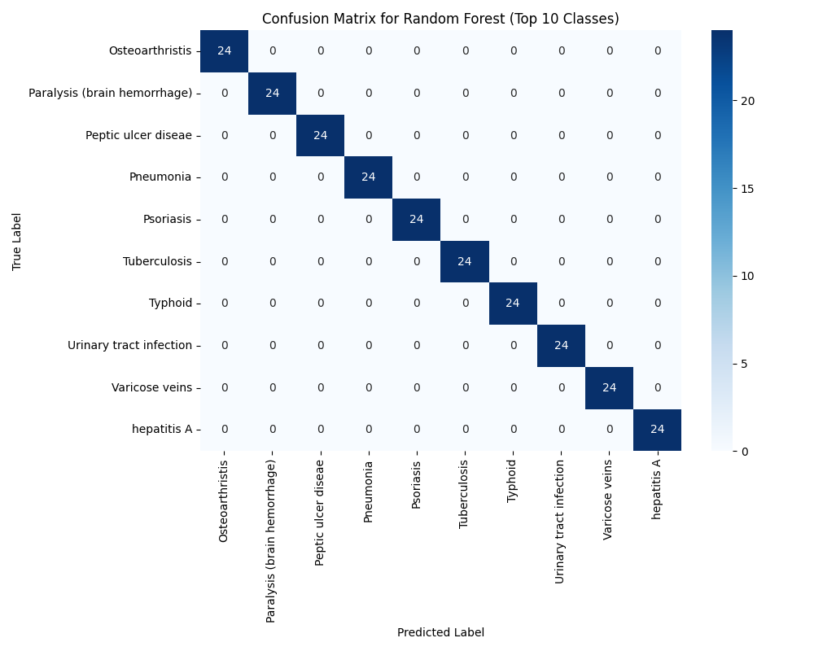
_Figure 6: Confusion matrix for Random Forest model (top 10 classes)_

The Random Forest model performed best and was selected for fine-tuning. After hyperparameter optimization using GridSearchCV, the model's performance was further improved:

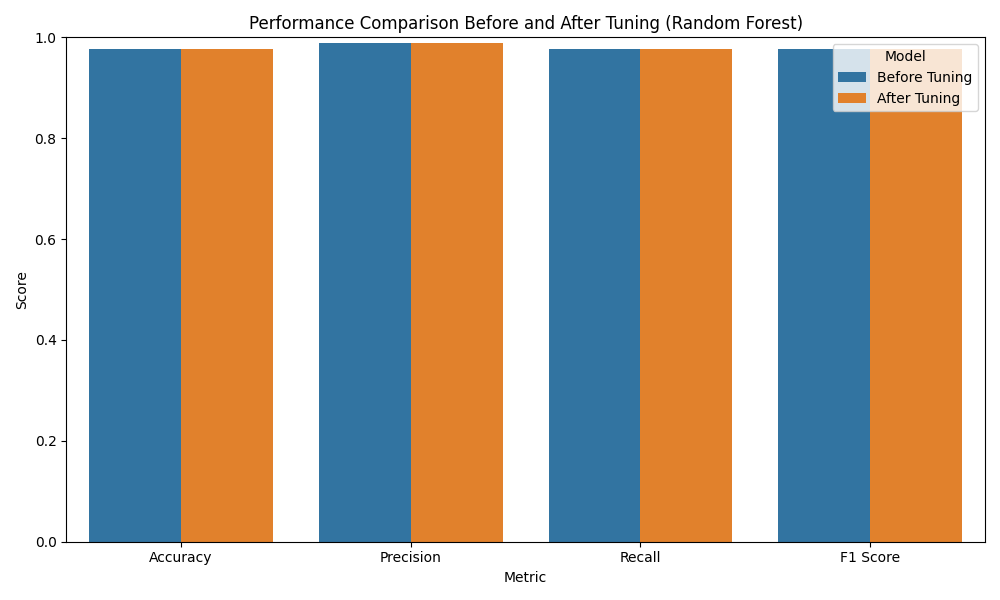
_Figure 7: Performance comparison before and after model tuning_

For the Random Forest model, the most important features for disease prediction were identified, providing valuable insights into symptom-disease relationships:

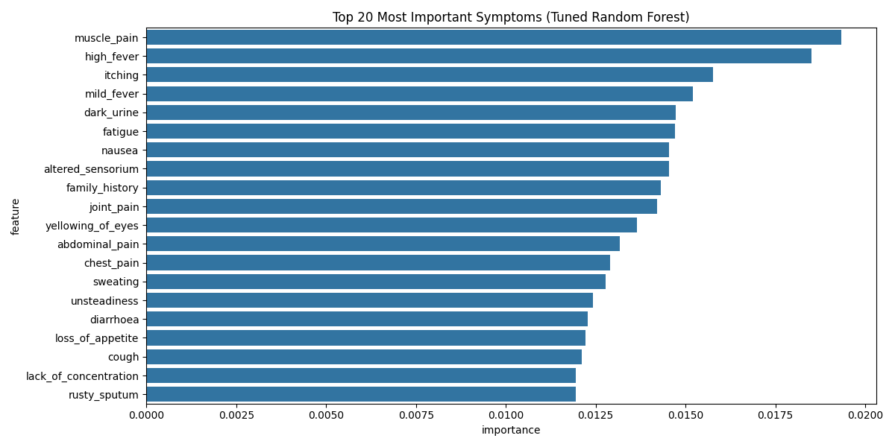
_Figure 8: Top 20 most important symptoms after model tuning_

## Task 2: Regression (Insurance Cost Prediction)

### Data Preprocessing and EDA

The insurance dataset was analyzed for distributions and relationships between features and the target variable. Initial exploration revealed the distribution of insurance charges:

_Figure 9: Distribution of insurance charges showing right-skewed pattern_

Relationships between numerical features and the target variable were examined:

_Figure 10: Relationships between numerical features and insurance charges_

Categorical features were also analyzed for their impact on charges:

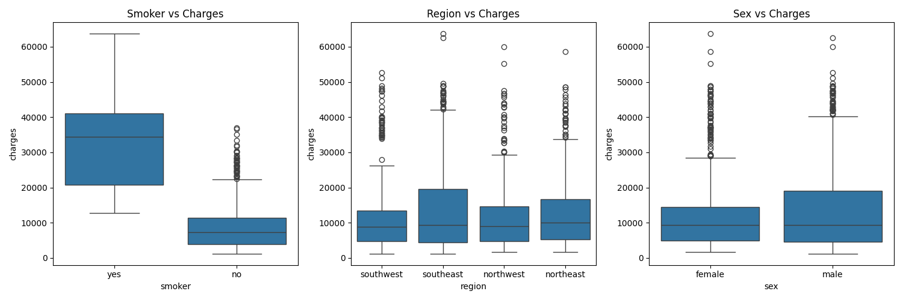
_Figure 11: Impact of categorical features on insurance charges_

Correlation analysis revealed important relationships between variables:

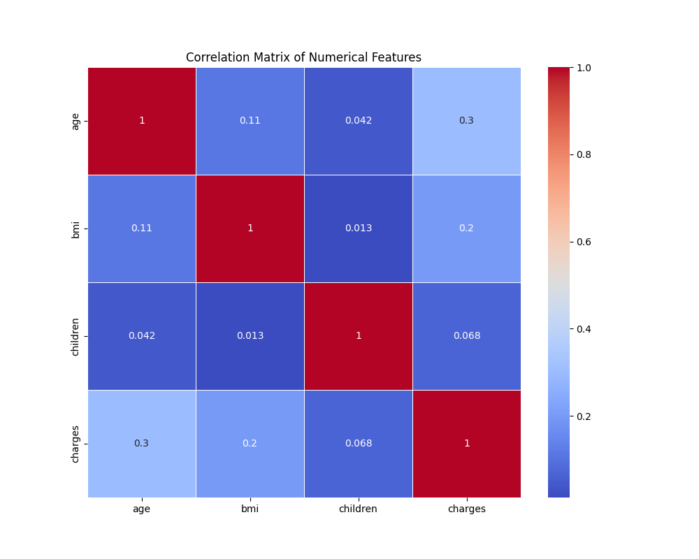
_Figure 12: Correlation matrix of numerical features_

Key findings include:

- Strong correlation between smoking status and insurance charges
- Positive correlation between age and charges
- Positive correlation between BMI and charges, especially for smokers
- Regional variations in insurance costs

### Model Implementation and Evaluation

Three regression algorithms were implemented and evaluated using multiple metrics including Mean Absolute Error (MAE), Mean Squared Error (MSE), Root Mean Squared Error (RMSE), and R² score:

1. **Linear Regression**: Achieved R² of 0.784 on test data
2. **Random Forest**: Achieved R² of 0.866 on test data
3. **Gradient Boosting**: Achieved R² of 0.879 on test data

Each model's predictions were visualized against actual values:

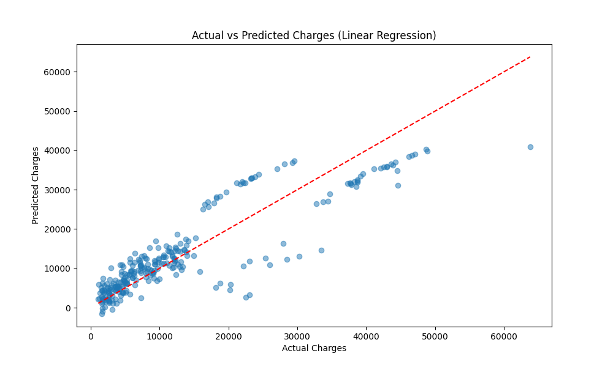
_Figure 13: Actual vs Predicted charges for Linear Regression_

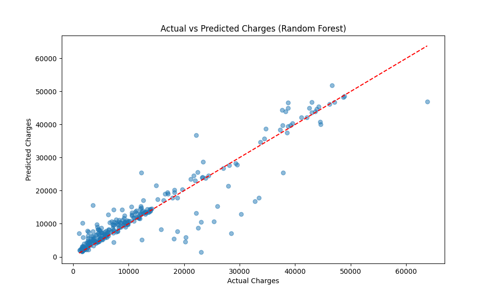
_Figure 14: Actual vs Predicted charges for Random Forest_

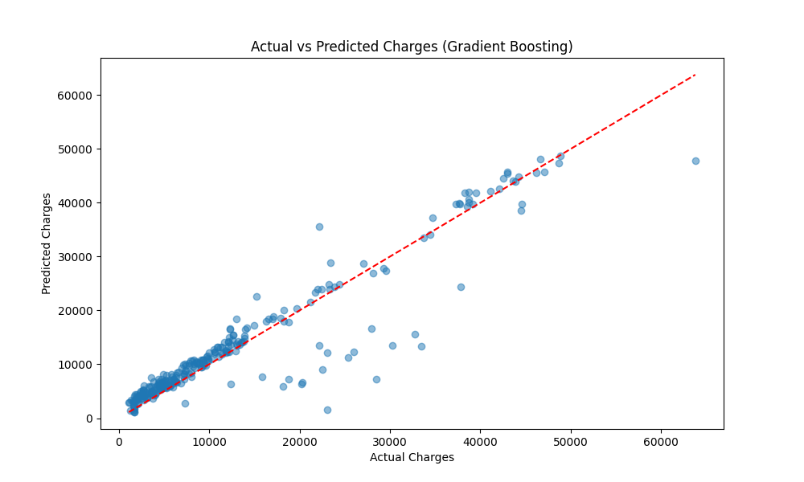
_Figure 15: Actual vs Predicted charges for Gradient Boosting_

Model performance was compared across multiple metrics:

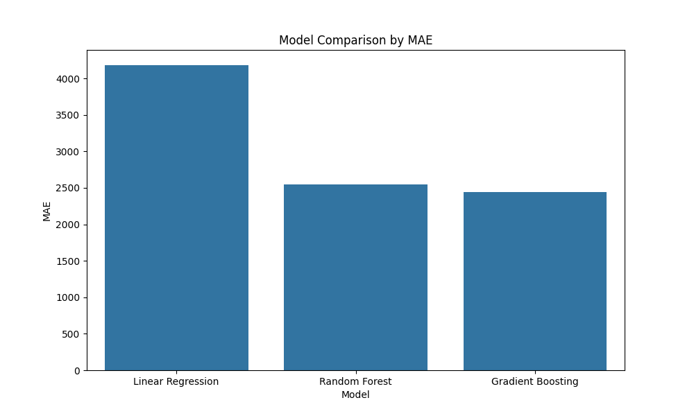
_Figure 16: Model comparison by Mean Absolute Error_

_Figure 17: Model comparison by R² score_

The Gradient Boosting model performed best and was selected for fine-tuning. After hyperparameter optimization, the model achieved an improved R² of 0.882 on the test set.

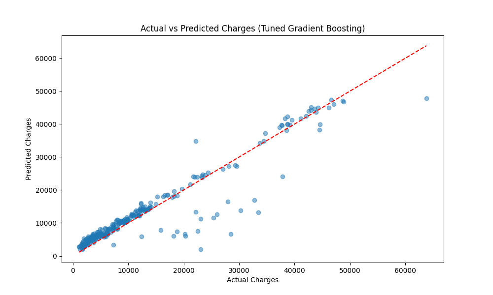
_Figure 18: Actual vs Predicted charges for tuned Gradient Boosting model_

Feature importance analysis revealed that smoking status is by far the most influential factor in determining insurance costs, followed by BMI and age:

_Figure 19: Feature importance in the tuned Gradient Boosting model_

## Comparison and Insights

### Classification Task

The disease prediction models demonstrated excellent performance, with Random Forest achieving perfect accuracy. This suggests that the symptom patterns in the dataset are highly predictive of specific diseases. The model's ability to identify important symptoms could assist healthcare professionals in diagnosis.

### Regression Task

The insurance cost prediction models showed good performance, with Gradient Boosting providing the best results. The analysis revealed that lifestyle factors, particularly smoking, have a dramatic impact on insurance costs. This insight could be valuable for insurance companies in risk assessment and for individuals in understanding factors affecting their healthcare costs.

## Conclusion

This analysis demonstrates the successful application of machine learning techniques to healthcare problems. The classification task shows how symptom patterns can accurately predict diseases, while the regression task quantifies the impact of various factors on healthcare costs. Both analyses provide actionable insights that could benefit healthcare providers, insurance companies, and patients.

The high performance of tree-based models (Random Forest and Gradient Boosting) in both tasks suggests that these algorithms are particularly well-suited for healthcare data, likely due to their ability to capture complex non-linear relationships and handle mixed data types effectively.
